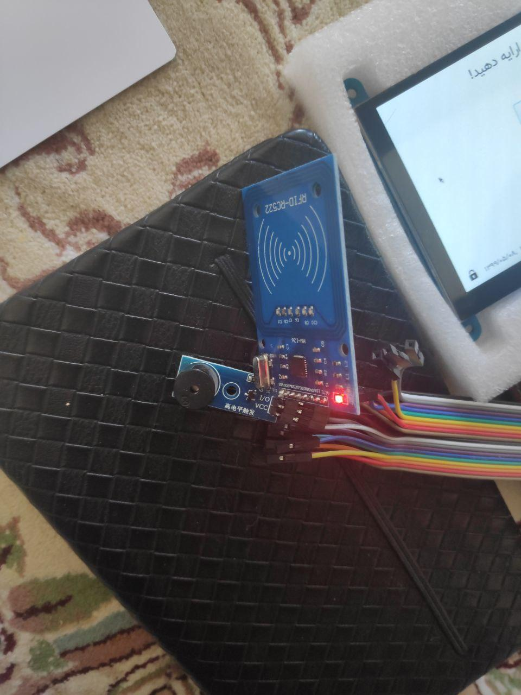
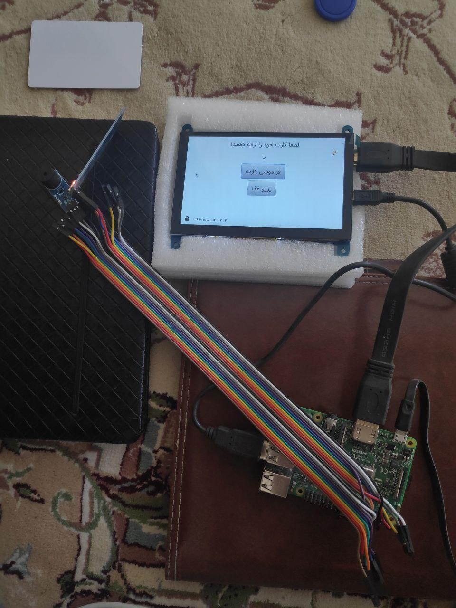
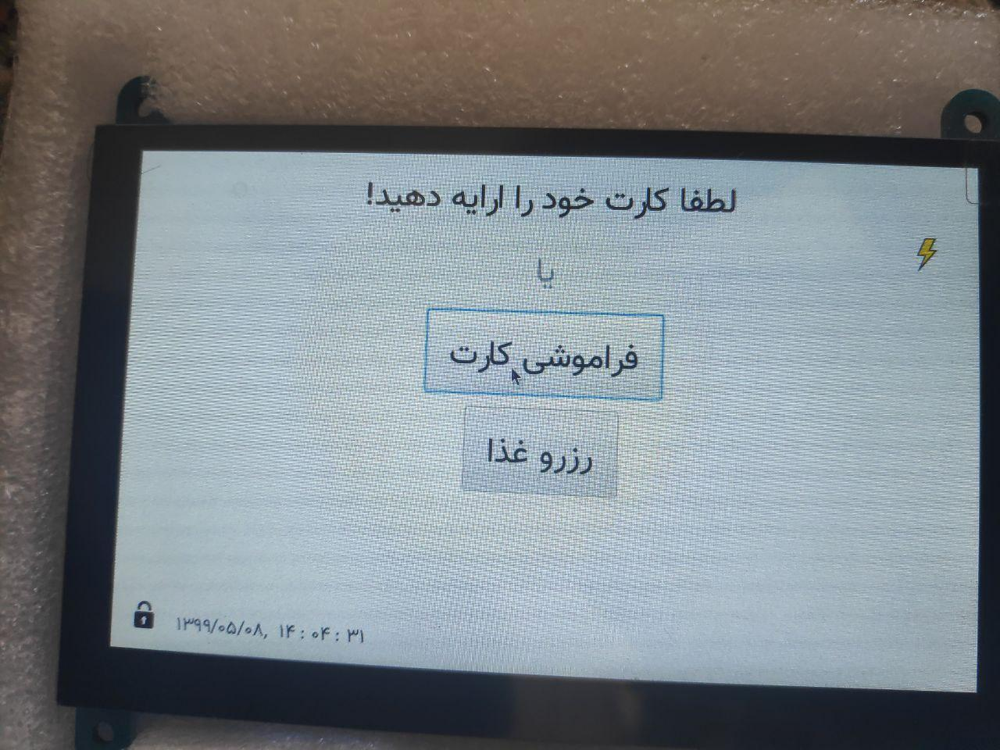
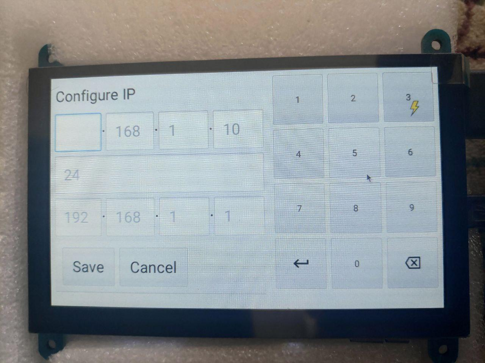
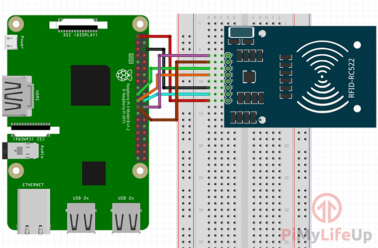
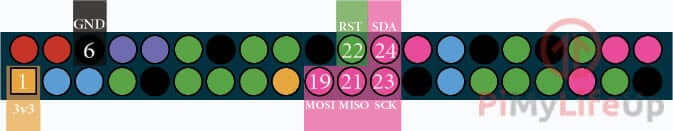

## Ramankav RFID Reader

A RFID reader with raspberry pi. users can provide their cards and app checkes if they have any reservation for that day.

### Screenshots:

### Assemble

Library that used in this project uses BCM port numbering
you need to convert numbers using picture below and use them 
in code.

for example IO port of buzzer uses port 24 in BCM numbering.

#### RFID

 - SDA connects to Pin 24.
 - SCK connects to Pin 23.
 - MOSI connects to Pin 19.
 - MISO connects to Pin 21.
 - GND connects to Pin 6.
 - RST connects to Pin 22.
 - 3.3v connects to Pin 1.
 

#### BUZZER

 - VCC connects to Pin 17.
 - I/O connects to Pin 18.
 - GND connects to Pin 20.

